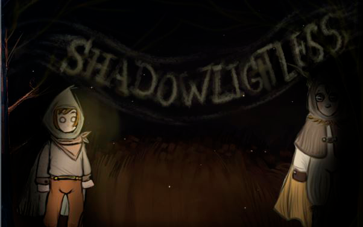
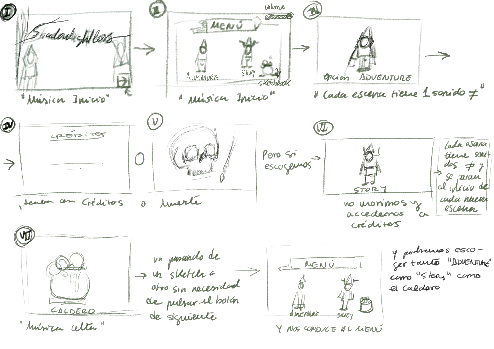

## SHADOWLIGHTLESS
Proyecto de Creación Multimedia Interactiva de la Facultad de Bellas Artes de la Universidad de Granada.

# Datos 

**Titulo** : “ Shadowlightless”

**Web:**   https://nataliargdny.github.io/ 
**Autor**: Ramírez García Natalia

**Resumen**: “ Shadowlightless”, un juego de aventuras, leyendas y misterio en el cual un joven debe de salvar a su aldea que ha sido devastada, para ello deberá de superar una serie de tenebrosos desafíos. 
Aunque también tenemos la opción de “Story” en la cual se narran todos los detalles sobre la historia de nuestro valeroso protagonista.

**Estilo/ Género**: Aventura gráfica y novela visual

**Logotipo**: 

**Resolución**: 1367 x 912 px

**Probado en** : Google Chrome ( en este navegador no se reproducen los sonidos de la primera escena, en cambio en Microsoft sí que se reproducen), Microsoft Edge y Móviles diversos, por lo general Android.

**Tamaño del proyecto:** 16,4 MB

**Fecha:** 12/06/2021

**Licencia:** Este proyecto tiene una Licencia MIT License

**Medios:**

- Github: https://nataliargdny.github.io/

# 2. MEMORIA DEL PROYECTO

### 2.1.- Storyboard:
Tras haberse reproducido la introducción del juego y del menú, nos encontramos ante dos opciones a escoger junto a un caldero:

##### - “ADVENTURE”: Pulsando esta opción, iniciarás el modo aventura del juego, la parte más relevante. Pues el protagonista deberá de descifrar una serie de acertijos para devolver la vida a su aldea y a sus habitantes. Una vez pulsada la opción, aparece la escena en la cual atacan al pueblo. En la siguiente escena aparece un misterioso halo de luz, un ojo demoníaco  que le revela su misión. En la tercera escena es donde tiene lugar el primer acertijo basado en un puzzle, pues debemos de encajar correctamente todas las piezas que conforman una especie de cabra, siempre y cuando no muramos en el intento, ya que el marcador situado en el lado izquierdo inferior nos descontará vidas si fallamos encajando las piezas. En el caso de obtener la victoria podremos pasar al siguiente enigma, en el cual debemos de encontrar tres objetos en una cueva para pasar la prueba, y al igual que en el anterior acertijo, nos descontarán vidas si pulsamos la calavera o calaveras incorrectas. Si en cualquiera de los enigmas se nos acaban las vidas, el juego nos conducirá a la escena de muerte y terminará la partida. Pero si en el caso contrario, vencemos. Siempre aparecerá el botón de derecha e izquierda para pasar a los siguientes retos.
Tras haber atravesado la cueva, llegaremos a un bosque repleto de oscuridad en el que nos topamos con un monstruo que nos anuncia nuestra victoria. Pasamos a otra escena en la que nuestro candelabro comienza a desprender una niebla azul persistente que se va extendiendo por el bosque y que nos conduce al pueblo de nuestro personaje, pues le hemos devuelto la vida al pueblo. Finalmente con el talismán rojo protegemos la aldea y termina el juego y da comienzo a los créditos y para volver a jugar deberemos de reiniciar el juego.

##### - “ STORY”: En esta opción descubriremos todas las claves e incertidumbres que nos genera el juego. Pues nos cuenta toda la historia de los objetos, quienes atacan a la villa, quien es en realidad el protagonista y cuál es el peligro al que se enfrenta.
En primer lugar tenemos la escena del cementerio que inicia el modo historia. Posteriormente pasamos automáticamente a la escena de lava que nos cuenta de dónde surge esta guerra. En la tercera escena nos muestra al mago luchando contra una sombra o demonio. En la escena número cuatro aparece la torre donde vive el mago, que más tarde, en la quinta escena, nos indica que vayamos a la cueva “ Go to the cavern” en la cual hallamos los objetos mágicos donde nos cuentan las propiedades de cada uno de ellos. Finalmente accedemos a los créditos y deberemos de reiniciar el juego para acceder a otras opciones como el caldero.
Otro detalle que tenemos que destacar es el volúmen del juego, pues en la parte superior tenemos un slider rojo con dos calaveras que nos indicarán como bajar o subir el sonido.
CALDERO o SKETCHBOOK:  Este objeto se encuentra en el menú del juego y nos conducirá a los bocetos, sketches, realizados para la creación de la aventura gráfica. Son un total de 10 escenas que nos muestran tanto el proceso de los personajes como el de los fondos y tras su finalización nos conducirá al menú.

### 2.2. Esquema de navegación

Esquema de navegación desde la introducción hasta la parte final que sería el sketchbook

# 3. METODOLOGÍA

### ETAPA 1: Ideación del proyecto

**Investigación de campo**(propuestas inspiradoras del proyecto)

*Libros de aventuras:*

- “DRAGÓN” De Ray Bradbury:  

https://www.amazon.es/Drag%C3%B3n-Ray-Bradbury/dp/8494773550
Escogido como referencia para los paisajes y ambientación de fantasía

- “  The Lord of the Rings “. J. R.R . Tolkien (1954) : 

https://www.amazon.es/Lord-Rings-J-R-Tolkien/dp/0618640150
 Escogido como referencia a la hora de crear el vestuario de los personajes, algunos de los objetos y seres que aparecen en el juego: el ojo en la niebla, el mago, el monstruo de lava...

- “DIBUJANTE NOCTURNO” Fran Garcés:

  https://www.instagram.com/dibujantenocturno/?hl=es

Me inspiró en gran medida para la realización de este juego, pues pensé que sería muy interesante un juego de aventura, fantasía, magia y misterio, repleto de seres mágicos.

*SERIES:*

https://www.cartoonnetwork.es/show/mas-alla-del-jardin
      
Fue una gran referencia para escoger el estilo de animación para el desarrollo del juego, pues los personajes de esta serie son simples, de tonalidades anaranjadas y verdosas y pensé en idear unos personajes o protagonistas siguiendo estos mismos parámetros.

**Motivación de la propuesta**

Lo cierto es que ha sido el primer juego que he diseñado, y pensé que sería bastante interesante incorporar todo aquello que me inspira en mi día a día para desarrollar todos mis dibujos, bocetos y proyectos de la facultad: la fantasía, la magia, las leyendas y los mitos de diversas culturas.
Por ello un día se me ocurrió un microrrelato y decidí plasmarlo rápidamente en mi sketchbook o cuaderno de campo, pues visualizaba mentalmente cómo iban a ir todas las escenas. Y poco a poco fui desarrollando todos los escenarios con la ayuda de mi tableta gráfica y dibujos que iba confeccionando a lápiz y con múltiples técnicas como las acuarelas o los lápices de colores. Y con la fusión de ambos métodos conseguí todos mis escenarios. 

Pienso que ha sido una experiencia compleja y muy gratificante, pues al “darle vida” a todo ese mundo creado he descubierto otras posibilidades de expresión artística, incluso un nuevo hobbie a practicar en mis ratos libres.

Al desarrollar este juego, pensé en mi infancia, ya que estuvo marcada por juegos, películas y series de este tipo, y pensé que sería una buena opción para niños con las mismas inquietudes que tenía yo. De este modo decidí crear una aventura cuya historia no fuese tan extensa como la de algunos videojuegos, sino que fuera interesante y dejase numerosas incógnitas a descubrir, es decir, dinámica). Y como está focalizada principalmente en niños, las vidas que aporto son un tanto ajustadas, por lo que incita a seguir jugando para descubrir el final que nos espera. 

**PÚBLICO/ AUDIENCIA**

- Ambientado para todas las edades, pero principalmente hacia niños de 8 a 11 años.

### ETAPA 2: Desarrollo/ actividades realizadas

#### 1.- PASAR ENTRE ESCENAS:

Para navegar entre escenas usaremos un botón que ejecutará la siguiente orden al pulsarlo -> SceneNext();

#### 2.- MÚSICA:

Para la música usaremos los fotogramas de scripts de cada escena y cuando queramos iniciar un sonido usaremos la orden: SoundPlay(sonido,bucle)

Para parar el sonido usaremos:  SoundStop(sonido)

Para modificar el volumen del sonido usaremos:  SoundSetVolume (sonido,volumen)

Y finalmente,combinando las anteriores y ubicándolas en los fotogramas que correspondan conseguiremos un efecto de sonido envolvente.

#### 3.- ACERTIJO DE LA PIEDRA (cabra):

Usaremos las siguientes variables y arrays para hacer funcionar el juego de la cabra:

. todasCorrectas: Variable booleana que indica si todas las cabras están correctamente colocadas. Inicialmente “false''.

. numeroCorrectas: Variable que lleva un conteo del número de piezas correctamente colocadas. Inicialmente 0

. piezasCorrectas: Array de booleanos con tantas posiciones como piezas tengamos. Cuando coloquemos una pieza en su posición correcta modificaremos la posición correspondiente de este array a “true”.
- piezasSeleccionadas: Array de booleanos con tantas posiciones como piezas tengamos. Una vez seleccionemos una pieza ponemos su posición correspondiente de este array a true.

. pulsadaAhora: Variable booleana que nos ayuda a saber si hay alguna pieza seleccionada en este momento.

#### 4.- VIDAS: Variable inicialmente establecida a 5 que, con cada fallo al colocar una pieza irá disminuyendo. Cuando la variable llegue a 0 viajaremos directamente a la Escena de Muerte usando la orden GotoSceneName(Escena).

También crearemos la función restaurarPiezas() que comprobará cada una de las posiciones del array piezasCorrectas y, para todas aquellas posiciones que estén a false, pondremos la misma posición del array piezasSeleccionadas a “false”. Esto nos ayuda a deseleccionar todas las piezas cuando fallemos a la hora de colocar una.

La idea de esta escena es añadir áreas calientes en cada una de las posiciones donde podemos colocar piezas. Cada pieza será a su vez un botón. Cuando pulsemos un área caliente comprobará si la posición correspondiente del array piezasSeleccionadas está puesta a true. Si es así colocará la pieza en su sitio. Si no es así, la des-seleccionará usando la función restaurarPiezas().

Por cada pieza colocada correctamente aumentará en uno la variable numeroCorrectas. Cuando esta variable llegue a 4 usaremos la orden Play() y haremos que la timeline siga avanzando.

#### 5.- CUEVA:

Usaremos las siguientes variables:

. calaveraEncontrada. Booleano que indica si la calvera ha sido encontrada.

. candelabroEncontrado. Booleano que indica si el candelabro ha sido encontrado.

. diamanteEncontrado. Booleano que indica si el diamante ha sido encontrado.

. objetosEncontrados. Variable que lleva un conteo del número de objetos encontrados. Inicialmente a 0.

La idea de esta parte es llegar a la escena de zonas calientes falsas y solo habrá 3 correctas. Por cada correcta seleccionada irá aumentando la variable objetosEncontrados. Cuando esta variable llegue a 3 usaremos la orden Play() para que la timeline siga avanzando. Y cada vez que se seleccione una zona caliente falsa, el número de vidas irá decreciendo.

#### 6.- CRÉDITOS:

Para mostrar los créditos iremos aumentando la componente “Y” de las texboxes para que vayan bajando por la pantalla.
Una vez salgan de la zona visible, restauramos el valor de la componente “Y'' y cambiamos el texto de las textboxes.

### ETAPA 3: Problemas identificados

Uno de los problemas más significativos en el proceso del juego, ha sido el sonido del inicio pues no se reproduce en todos los navegadores, como ocurre en Google Chrome (no lo reproduce ) y en Microsoft Edge ( en cambio este sí ) y no lo he podido reparar pues es algo del navegador a la hora de ejecutar el HTML.
También tuve problemas a la hora de dividir los archivos de la historia, pues en Hippani pesaban demasiado y debí de separarlos en dos archivos diferentes y cada uno creó un HTML, donde el HTML de la historia estaba enlazado al HTML principal.
Otro de los problemas más frecuentes a los que tuve que enfrentarme fue la deficiencia del programa, pues siempre se quedaba congelado transcurrido un tiempo y debía de guardar y reiniciarlo de nuevo. También se perdían una y otra vez una serie de imágenes exportadas que debía de importar contínuamente a pesar de estar todos los archivos en una carpeta para evitar este mismo suceso.
Otro de los problemas más curiosos es el cambio de tipografía, pues cambié de ordenador para proseguir con el proyecto y al seguir en mi ordenador se cambiaron de nuevo por lo que tuve que buscar otra que se asemejara a la anterior y fue bastante decepcionante.

# 4.- CONCLUSIONES

Sinceramente ha supuesto un reto personal, pues me ha llevado un mes de trabajo, teniendo en cuenta la planificación de la facultad. Y he de decir que me hubiera gustado dedicarle más tiempo a algunas partes para que quedara todo más fluido, sobre todo en la unión de las películas. A pesar de esto, pienso que he realizado un buen proyecto donde todos los escenarios han sido elaborados a mano y cuya historia es totalmente original, sin basarme en una historia o conjunto de historias, haciendo de este proyecto un juego único.

# 5.- REFERENCIAS

**Música:**

https://freesound.org/

http://recursostic.educacion.es/bancoimagenes/web/

https://www.elongsound.com/

**IMÁGENES:** NATALIA RAMÍREZ GARCÍA

**TIPOGRAFÍA:** Former Broston, Vintages y Palatino Linotype

**Herramientas utilizadas:**

- Hippani Animator 5.1
- Photoshop 2020
- Audacity (edición de audio)

https://creativecommons.org/licenses/?lang=es

***JUNIO 2021

### Comentarios:

Ejemplos de otros años: https://github.com/mgea/interart

https://github.com/SandraDomz/sandradomz.github.io
 

